# ABB IRB 1410 机械臂 ROS 控制项目

## 项目介绍

本项目基于 ROS (Robot Operating System) 实现了对 ABB IRB 1410 工业机械臂的运动规划和控制。通过 MoveIt 框架提供的功能，可以进行轨迹规划、碰撞检测、运动执行等操作。

## 项目文件目录介绍

项目主要由以下几个 ROS 包组成：

- **abb_1410_demo**: 提供机械臂的运动规划配置代码
- **abb_1410_moveit_config**: MoveIt 配置包，包含演示和应用程序，用于展示机械臂的运动功能
- **1410_URDF_test2**: 包含机械臂的 URDF 描述文件
- **abb_1410_gazebo**: 提供 Gazebo 模拟环境配置，用于仿真测试


## 项目环境介绍

- **操作系统**: Ubuntu 20.04 (推荐)
- **ROS 版本**: ROS Noetic
- **依赖库**:
  - MoveIt 框架
  - RViz 可视化工具
  - Gazebo 模拟器

## ABB IRB 1410 机械臂结构介绍

ABB IRB 1410 是一款工业级 6 自由度机械臂，特点如下：

- **自由度**: 6 个旋转关节
- **负载能力**: 约 5kg
- **工作范围**: 水平方向约 1.44m
- **关节结构**:
  - `base_link`: 基座
  - `link_1`: 转台
  - `link_2`: 大臂
  - `link_3`: 小臂
  - `link_4`: 腕部旋转
  - `link_5`: 腕部俯仰
  - `link_6`: 末端执行器连接

机械臂的运动通过配置的规划器（默认使用 OMPL），能够实现从当前位置到目标位置的无碰撞轨迹规划。

## 运行 abb_1410_demo 运动控制程序的方法
### 不使用Gazebo仿真：
1. 首先确保 ROS 环境已经初始化：
   ```bash
   source /opt/ros/noetic/setup.bash
   source ~/forAbb1410/devel/setup.bash  # 根据实际工作空间路径调整
   ```

2. 启动 MoveIt 演示环境：
   ```bash
   roslaunch abb_1410_moveit_config demo.launch
   ```

3. 在新的终端中运行演示程序：

   1.**正向运动学演示**：根据当处于给定的预设点时的关节角度，计算机器人末端执行器的位姿（位置和姿态），从而进行6点运动控制。
    ```bash
   rosrun abb_1410_demo moveit_fk_demo.py 
    ```
   2.**逆向运动学演示**：根据当处于预设点时末端执行器的目标位姿，计算满足该位姿的关节角度组合（可能存在多解或无解），从而进行6点运动控制。
    ```bash
   rosrun abb_1410_demo moveit_ik_demo.py 
    ```
   3.**MoveL演示**：在2的基础上将部分点之间的运动规划从MoveJ改为MoveL
   ```bash
   rosrun abb_1410_demo moveit_ik_moveL_demo.py 
   ```
   4.**轨迹规划演示**：控制机械臂完成包括8字形轨迹、圆形轨迹、螺旋轨迹在内的一系列轨迹。
    ```bash
    rosrun abb_1410_demo moveit_traj_demo.py 
    ```
   5.**避障演示**：控制机械臂完成避障演示
   ```bash
    rosrun abb_1410_demo moveit_obstacle_avoidance_demo.py 
    ```
    **附注**：当启动Rviz并执行以上任意一个程序之后可以在rviz中订阅话题`/visualization_marker/Marker`实时显示机械臂末端执行器的运动轨迹。
### 使用Gazebo仿真：
1. 首先确保 ROS 环境已经初始化：
   ```bash
   source /opt/ros/noetic/setup.bash
   source ~/forAbb1410/devel/setup.bash  # 根据实际工作空间路径调整
   ```
2. 启动 Gazebo 仿真环境与控制器、关节状态发布器：
   ```bash
   roslaunch abb_1410_gazebo abb_1410_bringup_moveit.launch
   ```
3. 启动 MoveIt 演示环境：
   ```bash
   roslaunch abb_1410_moveit_config demo.launch controller_manager:=ros_control
   ```

## 从零构建流程步骤

### 一. ROS 安装
#### 1.1 设置 ROS 软件源
```bash
sudo sh -c 'echo "deb http://packages.ros.org/ros/ubuntu $(lsb_release -sc) main" > /etc/apt/sources.list.d/ros-latest.list'
```
#### 1.2 添加密钥
```bash
sudo apt install curl       # 确保curl已安装
curl -s https://raw.githubusercontent.com/ros/rosdistro/master/ros.asc | sudo apt-key add -
```
#### 1.3 更新软件包列表
```bash
sudo apt update
```
#### 1.4 安装 ROS Noetic 桌面完整版
```bash
sudo apt install ros-noetic-desktop-full
```
#### 1.5 设置环境变量
```bash
echo "source /opt/ros/noetic/setup.bash" >> ~/.bashrc
source ~/.bashrc
```
#### 1.6 安装构建工具等其他package依赖
```bash
sudo apt install python3-catkin-tools python3-rosdep python3-rosinstall python3-rosinstall-generator python3-wstool build-essential
```
#### 1.7 初始化 rosdep(依赖管理工具)
```bash
sudo rosdep init
rosdep update
```
### 二. MoveIt 安装
```bash
# 安装 MoveIt
sudo apt install ros-noetic-moveit
# 安装MoveIt附加组件
sudo apt install ros-noetic-moveit-ros-visualization ros-noetic-moveit-planners ros-noetic-moveit-ros-move-group ros-noetic-moveit-ros-perception
```
### 三. 导出机械臂URDF模型并使用MoveIt Setup Assistant创建配置包
#### 3.1 创建工作空间
```bash
# 创建工作空间
mkdir -p ~/forAbb1410/src
cd ~/forAbb1410/
# 初始化工作空间
catkin init
```
#### 3.2 下载机械臂URDF模型
所使用机械臂的URDF模型可以通过SolidWorks等软件导出，或者直接从开源网站如Github上下载。在这里推荐一个开源的机器人模型库：[awesome-robot-descriptions](https://github.com/robot-descriptions/awesome-robot-descriptions)
本项目机械臂模型文件夹为`1410_URDF_test2`，包含了机械臂的URDF文件和相关资源。


#### 3.3 启动MoveIt Setup Assistant
```bash
roslaunch moveit_setup_assistant setup_assistant.launch
```
界面如下图所示：

点击箭头所指的按钮，选择`1410_URDF_test2`文件夹下的`/urdf/1410_URDF_test2.urdf`文件，或者其他任意机械臂模型的URDF文件，点击`Load File`按钮即可看到你所选择的机械臂模型。

### 3.4 配置Moveit配置包
在MoveIt Setup Assistant中，左边一列是一系列的MoveIt配置选项，具体内容如下：

接下来，我们将逐步配置MoveIt各项设置。
#### 3.4.1 生成碰撞矩阵
点击左侧的`Self-Collisions`按钮，进入机械臂自碰撞检测，点击红色箭头指示的`Generate Collision Matrix`即可生成自碰撞矩阵，在这里可检查配置的机械臂各关节之间是否会发生自碰撞等信息。

#### 3.4.2 规划组配置
点击左侧的`Planning Groups`按钮，进入规划组配置，点击红色箭头指示的`Add Group`即可添加规划组，

按照箭头顺序，我们首先为该规划组命名，一般来说我们命名为`manipulator`或`Manipulator`；然后我们选择运动学求解器`Kinematic Solver`，一般选择`KDL`；接下来我们一般设定OMPL规划器为`RRTConnectkConfigDefault`；最后我们点击`Add Kin. chain`按钮，添加机械臂的运动学链，选择`base_link`为根节点，选择`link_6`为末端执行器节点，点击`Save`按钮即可完成规划组配置。


#### 3.4.3 机器人姿态配置
点击左侧的`Robot Poses`按钮，进入机器人姿态配置，点击红色箭头指示的`Add Pose`按钮即可添加机器人姿态配置。

通过设定右侧各个关节的旋转角度，来设定机械臂的姿态，同时对当前姿态进行命名，点击`Save`按钮即可完成机器人姿态配置，保存当前设置的姿态信息。

如图所示，我设置了一个`home`姿态，表示机械臂的初始位置。你也可以保存其他姿态，方便后续的运动控制。
#### 3.4.4 个人信息设置
点击左侧的`Author Information`按钮，进入个人信息设置，即可填写个人的姓名、邮箱等信息，以便于他人使用你的配置文件时联系你。

#### 3.4.5 配置信息确认与保存
点击左侧的`Configuration Files`按钮，进入配置文件确认与保存界面，配置文件保存地址选择刚刚在我们创建的工作空间下的src文件夹下新建一个moveit配置文件夹，习惯来说我们会以`xxx_moveit_config`来命名该文件夹以代表其为MoveIt配置文件夹，点击`Generate Package`按钮即可生成MoveIt配置包。


### 3.5 编译项目
```bash
# 回到工作空间
cd ~/forAbb1410/
# 编译
catkin_make
# 刷新环境
source devel/setup.bash
```
### 3.6 启动MoveIt Rviz演示
```bash
roslaunch abb_1410_moveit_config demo.launch
```

这将启动RViz，显示机械臂的模型，并可以通过MoveIt插件进行规划和控制。

### 四. 机械臂控制脚本编写
#### 4.1 创建控制脚本包
在工作空间下的src文件夹下创建一个新的ROS包，命名为`abb_1410_demo`，其中将储存机械臂控制脚本。
```bash
cd ~/forAbb1410/src
catkin_create_pkg abb_1410_demo moveit_ros_planning_interface roscpp rospy std_msgs geometry_msgs
```
#### 4.2 正向运动学6点控制
##### 4.2.1 正向运动学简介
正向运动学是指根据机械臂各关节的角度，计算出末端执行器的位置和姿态。通过正向运动学，我们可以控制机械臂的末端执行器到达指定的位置和姿态。
##### 4.2.1 新建正向运动学控制脚本
```bash
cd ~/forAbb1410/src/abb_1410_demo
mkdir scripts
cd scripts
touch moveit_fk_demo.py
chmod +x moveit_fk_demo.py
```
##### 4.2.2 编辑正向运动学控制脚本
使用您喜欢的编辑器打开 `moveit_fk_demo.py` 文件并添加配置代码
代码内容内容详见[./src/abb_1410_demo/scripts/moveit_fk_demo.py](./src/abb_1410_demo/scripts/moveit_fk_demo.py)
##### 4.2.3 代码解析
该正向运动学控制脚本实现了以下功能：

1. **初始化设置**：
   - 初始化MoveIt API和ROS节点
   - 设置参考坐标系为`base_link`
   - 配置运动组为`Manipulator`
   - 设置运动精度、最大速度和加速度限制

2. **轨迹可视化**：
   - 创建轨迹标记发布器，用于在RViz中可视化末端执行器的运动轨迹
   - 实现轨迹点记录和清除功能
   - 使用红色线条实时显示机械臂末端执行器的运动路径

3. **预设关节位置**：
   - 预定义7组关节角度值，代表机械臂需要依次到达的7个位置
   - 最后一组为全零位置，使机械臂回到中立姿态

4. **执行流程**：
   - 首先清除之前的轨迹记录
   - 启动轨迹记录定时器，每0.05秒记录一次当前末端执行器位置
   - 依次执行预设的7组关节角度移动
   - 每次移动后暂停1秒，便于观察
   - 最后回到初始化位置（home），并关闭MoveIt
##### 4.2.4 核心方法详解
正向运动学控制脚本中使用的核心方法及其功能:
1. **MoveIt 初始化与配置方法**:
   - `moveit_commander.roscpp_initialize(sys.argv)`: 初始化 MoveIt 的 C++ 接口
   - `rospy.init_node('moveit_fk_demo', anonymous=True)`: 创建 ROS 节点
   - `self.arm = moveit_commander.MoveGroupCommander('Manipulator')`: 创建机械臂控制对象，指定规划组名称
   - `self.arm.set_goal_joint_tolerance(0.001)`: 设置关节角度规划的误差容忍度
   - `self.arm.set_max_acceleration_scaling_factor(0.5)`: 限制最大加速度为默认值的 50%
   - `self.arm.set_max_velocity_scaling_factor(0.5)`: 限制最大速度为默认值的 50%

2. **机械臂位置控制方法**:
   - `self.arm.set_named_target('home')`: 设置目标位置为命名姿态 'home'（在 MoveIt Setup Assistant 中定义）
   - `self.arm.set_joint_value_target(joint_position)`: 通过关节角度值设置目标位置
   - `self.arm.go()`: 规划并执行移动到目标位置，返回是否成功的布尔值
   - `self.arm.get_current_pose(self.end_effector_link)`: 获取当前末端执行器的位姿

3. **轨迹记录与可视化方法**:
   - `self.marker_publisher = rospy.Publisher('/visualization_marker', Marker, queue_size=100)`: 创建标记消息发布器
   - `rospy.Timer(rospy.Duration(0.2), self.publish_trajectory_marker)`: 创建定时器，定期执行轨迹标记发布
   - `self.record_trajectory_point()`: 记录当前末端执行器位置
   - `self.publish_trajectory_marker()`: 将记录的轨迹点转换为 RViz 可视化标记并发布
   - `self.clear_trajectory()`: 清除之前记录的轨迹点和可视化标记

4. **Marker 消息创建**:
   - `marker = Marker()`: 创建 RViz 可视化标记对象
   - `marker.type = Marker.LINE_STRIP`: 设置标记类型为线条
   - `marker.action = Marker.ADD`: 添加新标记
   - `marker.lifetime = rospy.Duration(0)`: 设置标记永久存在（直到被删除）

5. **程序控制流方法**:
   - `rospy.sleep(1)`: 暂停程序执行指定秒数
   - `trajectory_recorder = rospy.Timer(...)`: 创建定时器对象记录轨迹
   - `trajectory_recorder.shutdown()`: 停止定时器
   - `moveit_commander.roscpp_shutdown()`: 关闭 MoveIt 接口
   - `moveit_commander.os._exit(0)`: 安全退出程序

这些方法结合起来，实现了通过预设的关节角度序列控制机械臂运动，并同时记录和可视化末端执行器的运动轨迹。其中，FK (Forward Kinematics, 正向运动学) 的核心在于通过直接指定关节角度 (`set_joint_value_target`) 来控制机械臂运动，而不是通过指定末端执行器的位置和姿态。这种方法在需要精确控制各关节角度的场景中特别有用。
##### 4.2.5 效果展示

#### 4.3 逆向运动学6点控制
##### 4.3.1 逆向运动学简介
逆向运动学是指根据机械臂末端执行器的目标位置和姿态，计算出满足该位姿的关节角度组合。通过逆向运动学，我们可以控制机械臂的末端执行器到达指定的位置和姿态。
##### 4.3.1 新建逆向运动学控制脚本
```bash
cd ~/forAbb1410/src/abb_1410_demo/scripts
touch moveit_ik_demo.py
chmod +x moveit_ik_demo.py
```
##### 4.3.2 编辑逆向运动学控制脚本
使用您喜欢的编辑器打开 `moveit_ik_demo.py` 文件并添加配置代码
代码内容内容详见[./src/abb_1410_demo/scripts/moveit_ik_demo.py](./src/abb_1410_demo/scripts/moveit_ik_demo.py)
##### 4.3.3 代码解析
该逆向运动学控制脚本实现了以下功能：

1. **初始化与配置**：
   - 初始化MoveIt API和ROS节点
   - 配置机械臂控制组为`Manipulator`
   - 设置参考坐标系为`base_link`
   - 配置位置和姿态的允许误差
   - 设置规划失败重试许可和最大速度/加速度限制

2. **轨迹可视化**：
   - 与FK脚本类似，提供了轨迹记录和可视化功能
   - 使用红色线条实时显示机械臂末端执行器的运动轨迹

3. **预设目标位姿**：
   - 预定义7个末端执行器的目标位姿，每个位姿使用位置(x,y,z)和四元数姿态(x,y,z,w)表示
   - 位姿序列组成了一个方形轨迹，用于演示机械臂的运动规划能力

4. **关节角度输出**：
   - 提供关节角度打印功能，同时显示弧度和角度单位
   - 在每个位姿规划成功后显示对应的关节角度值

5. **执行流程**：
   - 清除之前的轨迹记录
   - 获取预设的目标位姿序列
   - 开始记录轨迹
   - 依次设置每个目标位姿，规划并执行移动
   - 打印当前关节角度
   - 移动完成后恢复到初始化位置，关闭MoveIt
##### 4.3.4 核心方法详解
逆向运动学控制脚本中使用的核心方法及其功能:

1. **MoveIt配置相关方法**:
   - self.arm.set_pose_reference_frame(self.reference_frame): 设置位姿参考坐标系
   - self.arm.allow_replanning(True): 允许在规划失败时重新规划
   - self.arm.set_goal_position_tolerance(0.001): 设置位置误差容忍度(米)
   - self.arm.set_goal_orientation_tolerance(0.01): 设置姿态误差容忍度(弧度)
   - self.arm.get_active_joints(): 获取活动关节名称列表
2. **逆向运动学核心方法**:
   - self.arm.set_pose_target(target_pose): 设置末端执行器的目标位姿
   - self.arm.plan(): 规划从当前位置到目标位姿的轨迹，返回规划结果
   - self.arm.execute(traj): 执行规划出的轨迹
   - self.arm.set_start_state_to_current_state(): 设置规划起点为当前状态
3. **姿态构建与关节状态方法**:
   - target_pose = PoseStamped(): 创建带有时间戳和参考坐标系的位姿对象
   - target_pose.pose.position.x/y/z: 设置目标位置坐标
   - target_pose.pose.orientation.x/y/z/w: 设置目标姿态四元数
   - self.arm.get_current_joint_values(): 获取当前关节角度值
   - np.degrees(current_joints): 将弧度转换为角度
4. **规划结果处理**:
   - if plan and isinstance(plan, tuple) and plan[0]: 检查规划是否成功
   - traj = plan[1]: 从规划结果中提取轨迹部分
   - self.print_joint_angles(): 打印当前关节角度，便于调试

与正向运动学不同的是，这里使用了`set_pose_target`方法设置末端执行器的目标位姿，而不是直接设置关节角度值。MoveIt会自动进行逆向运动学(IK)求解，计算出到达该位姿所需的关节角度组合。这种基于任务空间的控制方式更符合大多数实际应用场景，用户只需关心工具的位置和姿态，而不需要计算具体的关节角度。
##### 4.3.5 效果展示

#### 4.4 逆向运动学 MoveL 4点控制
##### 4.4.1 MoveL简介
MoveL是指机械臂在运动过程中，末端执行器沿着一条直线轨迹移动，而不是沿着关节空间的路径进行运动。MoveL通常用于需要精确控制末端执行器位置的场景，如焊接、喷涂等应用。
##### 4.4.2 新建MoveL控制脚本
```bash
cd ~/forAbb1410/src/abb_1410_demo/scripts
touch moveit_ik_moveL_demo.py
chmod +x moveit_ik_moveL_demo.py
```
##### 4.4.3 编辑MoveL控制脚本
使用您喜欢的编辑器打开 `moveit_ik_moveL_demo.py` 文件并添加配置代码
代码内容内容详见[./src/abb_1410_demo/scripts/moveit_ik_moveL_demo.py](./src/abb_1410_demo/scripts/moveit_ik_moveL_demo.py)
##### 4.4.4 代码解析
该MoveL控制脚本实现了以下功能：
1. **初始化与配置**：
   - 初始化MoveIt API和ROS节点
   - 配置机械臂控制组为`Manipulator`
   - 设置参考坐标系为`base_link`
   - 配置位置和姿态的允许误差
   - 设置规划失败重试许可和最大速度/加速度限制
2. **轨迹可视化**：
   - 与FK脚本类似，提供了轨迹记录和可视化功能
   - 使用红色线条实时显示机械臂末端执行器的运动轨迹
3. **预设目标位姿**：
   - 预定义4个末端执行器的目标位姿，每个位姿使用位置(x,y,z)和四元数姿态(x,y,z,w)表示
   - 位姿序列组成了一个方形轨迹，用于演示机械臂的运动规划能力
4. **关节角度输出**：
   - 提供关节角度打印功能，同时显示弧度和角度单位
   - 在每个位姿规划成功后显示对应的关节角度值
5. **执行流程**：
   - 清除之前的轨迹记录
   - 获取预设的目标位姿序列
   - 开始记录轨迹
   - 依次设置每个目标位姿，规划并执行移动
   - 打印当前关节角度
   - 移动完成后恢复到初始化位置，关闭MoveIt
##### 4.4.5 核心方法详解
**笛卡尔路径规划方法:**
- `arm.compute_cartesian_path(waypoints, 0.01, avoid_collisions=True):` 关键方法，根据给定路径点计算一条笛卡尔空间中的直线路径
   - **第一个参数 waypoints** 是位姿点列表，定义了直线路径的起点和终点
   - **第二个参数 0.01** 是路径分辨率(米)，控制路径点密度
   - **第三个参数 avoid_collisions** 决定是否进行碰撞检测和避障
   - **返回值 (plan, fraction):** plan 包含规划的轨迹；fraction 表示成功规划的路径比例(0~1)，1.0表示完整路径规划成功
##### 4.4.6 MoveL总结
该脚本中混合使用了两种不同的运动规划方法:
   - 对于路径点1→2和3→4: 使用 compute_cartesian_path 实现直线运动(MoveL)
   - 对于路径点2→3和4→5: 使用普通的 plan() 方法实现关节空间运动(MoveJ)

这种混合策略展示了在不同场景下选择最合适的运动规划方式

MoveL方式的关键优势在于能够保证末端执行器严格沿直线路径移动，这在某些工业应用中非常重要，例如:
- 焊接: 需要沿着焊缝直线移动
- 切割: 需要沿着切割线直线移动
- 喷涂: 需要保持与表面的一致距离
- 装配: 需要沿着特定轨迹插入零件

与普通IK不同，MoveL保证了末端轨迹的几何特性，而不仅仅是起点和终点位姿的匹配。由于使用了笛卡尔空间规划，MoveL可能会受到机械臂运动学限制的影响，在某些情况下无法规划完整的直线路径。
##### 4.4.7 效果展示

如图所示，路径点home→1,1→2与3→4为MoveL路径，路径点2→3与4→home为MoveJ路径，由图上显示的轨迹可以清晰看到它们的区别。

#### 4.5 特定轨迹控制
##### 4.5.1 简介
特定轨迹控制是指机械臂沿着预定义的轨迹进行运动，这些轨迹可以是圆形、椭圆形、螺旋形等复杂路径。通过特定轨迹控制，我们可以实现更复杂的运动模式，满足不同的工业应用需求。
##### 4.5.2 新建特定轨迹控制脚本
```bash
cd ~/forAbb1410/src/abb_1410_demo/scripts
touch moveit_traj_demo.py
chmod +x moveit_traj_demo.py
```
##### 4.5.3 编辑特定轨迹控制脚本
使用您喜欢的编辑器打开 `moveit_traj_demo.py` 文件并添加配置代码
代码内容内容详见[./src/abb_1410_demo/scripts/moveit_traj_demo.py](./src/abb_1410_demo/scripts/moveit_traj_demo.py)
##### 4.5.4 代码解析
该特定轨迹控制脚本实现了以下功能：
1. **复杂轨迹生成**：
   - create_figure8_trajectory: 生成8字形轨迹点列表
   - create_ellipse_trajectory: 生成椭圆形轨迹点列表
   - create_spiral_trajectory: 生成螺旋形轨迹点列表
   - 每个轨迹都可自定义参数如中心位置、尺寸、点密度等

2. **笛卡尔路径规划**：
   - 使用compute_cartesian_path方法确保末端执行器严格按照预定义的轨迹点移动
   - 通过设置合适的路径分辨率`eef_step=0.01`来控制轨迹点的密度

3. **交互式操作界面**：
   - 实现了一个简单的交互式菜单，可以通过命令行选择执行不同的轨迹
   - 支持多种操作：执行8字轨迹、椭圆轨迹、螺旋轨迹、返回起始位置、清除轨迹显示

4. **轨迹可视化**：
   - 与之前的脚本一样，提供了轨迹记录和实时可视化功能
   - 在RViz中直观地展示机械臂末端执行器的运动轨迹

5. **错误处理机制**：
   - 对轨迹规划失败的情况进行处理，提供详细的错误信息
   - 当规划成功率低于阈值时，提供警告并允许用户重试
##### 4.5.5 特定轨迹类型介绍
- **8字形轨迹：**
使用参数方程 `x = sin(t), y = sin(t) * cos(t)` 生成
可调整宽度、高度和点密度
在XY平面内形成经典的8字形状
- **椭圆轨迹：**
使用参数方程 `x = a * cos(t), y = b * sin(t)` 生成
可调整长轴a、短轴b和点密度
通过改变a和b的值可以得到不同形状的椭圆，包括圆形(a=b)
- **螺旋轨迹：**
在XY平面的圆形基础上，添加Z轴方向的线性变化
可调整半径、高度、螺旋圈数和点密度
形成一个三维的上升或下降螺旋形状
##### 4.5.6 效果展示
###### 8字形轨迹
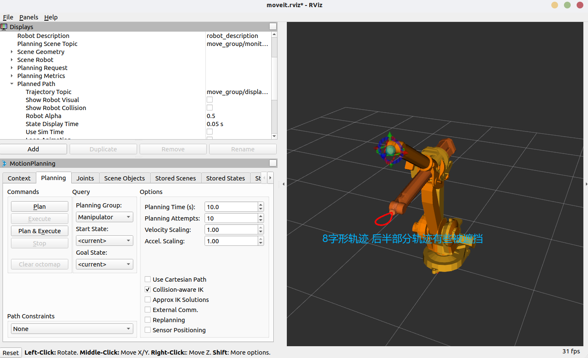
###### 椭圆轨迹
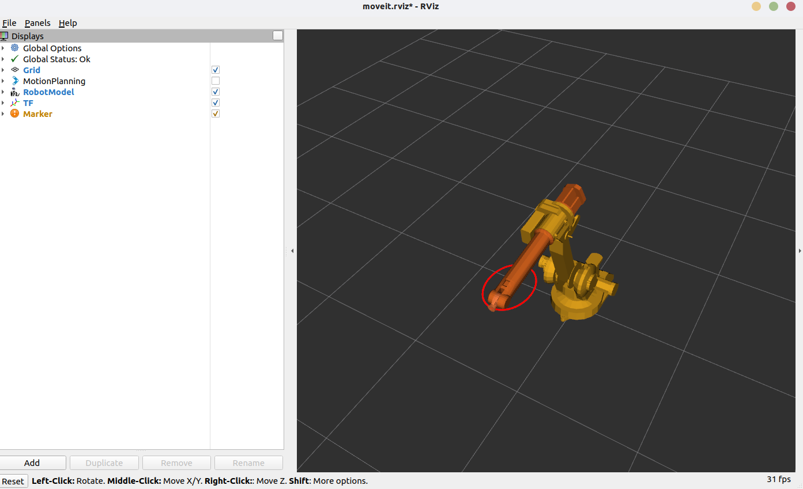
###### 螺旋轨迹
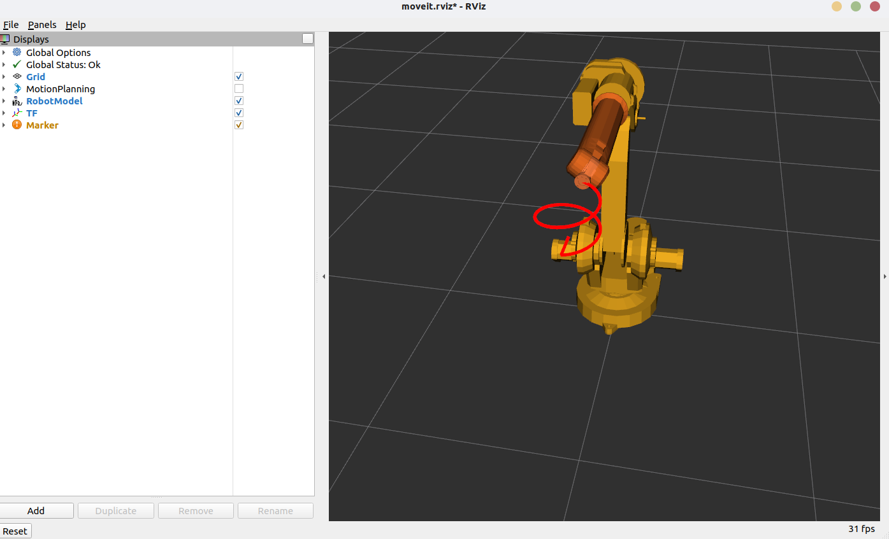

#### 4.6 运动避障
##### 4.6.1 简介
运动避障是指在机械臂运动过程中，实时检测和避免与周围环境或其他物体发生碰撞。通过运动避障，我们可以确保机械臂在执行任务时的安全性和可靠性。
##### 4.6.2 新建运动避障控制脚本
```bash
cd ~/forAbb1410/src/abb_1410_demo/scripts
touch moveit_obstacle_avoidance_demo.py
chmod +x moveit_obstacle_avoidance_demo.py
```
##### 4.6.3 编辑运动避障控制脚本
使用您喜欢的编辑器打开 `moveit_obstacle_avoidance_demo.py` 文件并添加配置代码
代码内容内容详见[./src/abb_1410_demo/scripts/moveit_obstacle_avoidance_demo.py](./src/abb_1410_demo/scripts/moveit_obstacle_avoidance_demo.py)
##### 4.6.4 代码解析
该运动避障控制脚本实现了以下功能：
1. **障碍物定义**：
   - 使用`add_cylinder`方法定义一个圆柱体障碍物
   - 设置障碍物的位置、大小和颜色
   - 将障碍物添加到碰撞检测场景中
2. **避障规划策略：**
- 利用MoveIt的内置碰撞检测功能自动识别障碍物
- 设置较高的规划时间和尝试次数，提高避障规划成功率
- 规划失败时自动增加规划参数并重试
3. **路径可视化：**
- 使用蓝色线条标记记录和显示机械臂末端执行器的避障轨迹
- 实时记录轨迹点，直观展示避障效果
- 清晰显示机械臂如何绕过障碍物到达目标位置
##### 4.6.5 避障原理详解
MoveIt的避障功能基于以下几个关键技术原理：
1. **碰撞检测：**
- MoveIt使用FCL(Flexible Collision Library)进行高效碰撞检测
- 机械臂的每个链接与环境中的障碍物都进行碰撞检测
- 碰撞检测在轨迹规划的每个采样点上进行，确保整条路径无碰撞
2. **采样规划算法：**
- 主要使用基于采样的规划算法(OMPL)，如RRT, RRTConnect, PRM等
- 这些算法在机械臂的配置空间(C-space)中随机采样，构建路径
- 只有无碰撞的配置状态和连接才会被保留和探索
3. **配置空间转换：**
- 将3D工作空间中的障碍物转换到机械臂的配置空间(关节空间)
- 在配置空间中，机械臂被简化为一个点，障碍物被"膨胀"
- 规划算法在这个转换后的空间中寻找从起点到终点的无碰撞路径
4. **路径优化：**
- 初始路径找到后，MoveIt会进行路径优化
- 优化目标包括路径长度、平滑度和与障碍物的距离
- 保证路径不仅无碰撞，而且更加高效和自然
##### 4.6.6 核心方法介绍
1. `add_cylinder`圆柱形障碍物创建方法
2. `create_obstacle_environment`障碍物环境创建方法
##### 4.6.7 效果展示
###### 有障碍物环境
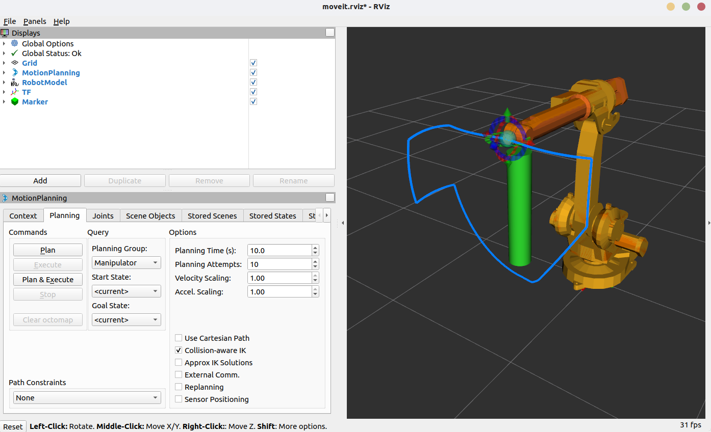
###### 无障碍物环境


#### 4.7 机械臂控制应用
综合以上的已经实现的各运动规划的功能，我创建了一个使用机械臂打磨圆柱体的应用程序。其效果如下：
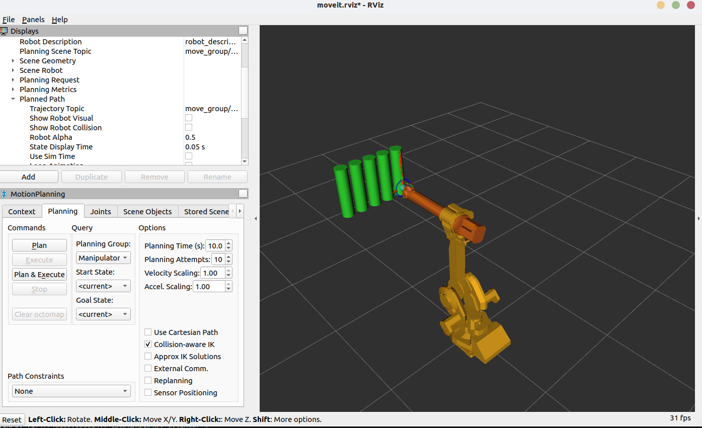
如图所示，机械臂在圆柱体上进行打磨操作，机械臂将不断进行Z轴方向上的MoveL运动而圆柱体也会不断沿Y轴运动，从而使得每个圆柱体都能被打磨到。该应用程序的代码详见[./src/abb_1410_demo/scripts/moveit_sanding_demo.py](./src/abb_1410_demo/scripts/moveit_app_demo.py)。
这体现了该ABB IRB 1410机械臂的灵活性和高效性，能够在复杂的工业环境中执行多种任务，如打磨、焊接、装配等。通过结合运动规划、避障和特定轨迹控制等技术，我们可以实现更复杂的自动化操作，提高生产效率和安全性。
### 五. MoveIt + Gazebo 联合仿真配置
#### 5.1 Gazebo简介
##### 5.1.1 Gazebo简介
Gazebo是一个开源的3D机器人仿真器，提供了高保真的物理引擎、传感器模拟和环境建模功能。它允许开发者在虚拟环境中测试和验证机器人算法，而无需依赖真实硬件。Gazebo支持多种机器人模型格式，如URDF、SDF等，并与ROS无缝集成，使得开发者可以轻松地在Gazebo中运行ROS节点和控制器。
##### 5.1.2 ROS中的控制器插件
**ros_control**是什么？
- ROS为开发者提供的机器人控制中间件
- 包含一系列控制器接口、传动装置接口、硬件接口、控制器工具箱等
- 可以帮助机器人应用功能包快速落地，提高开发效率
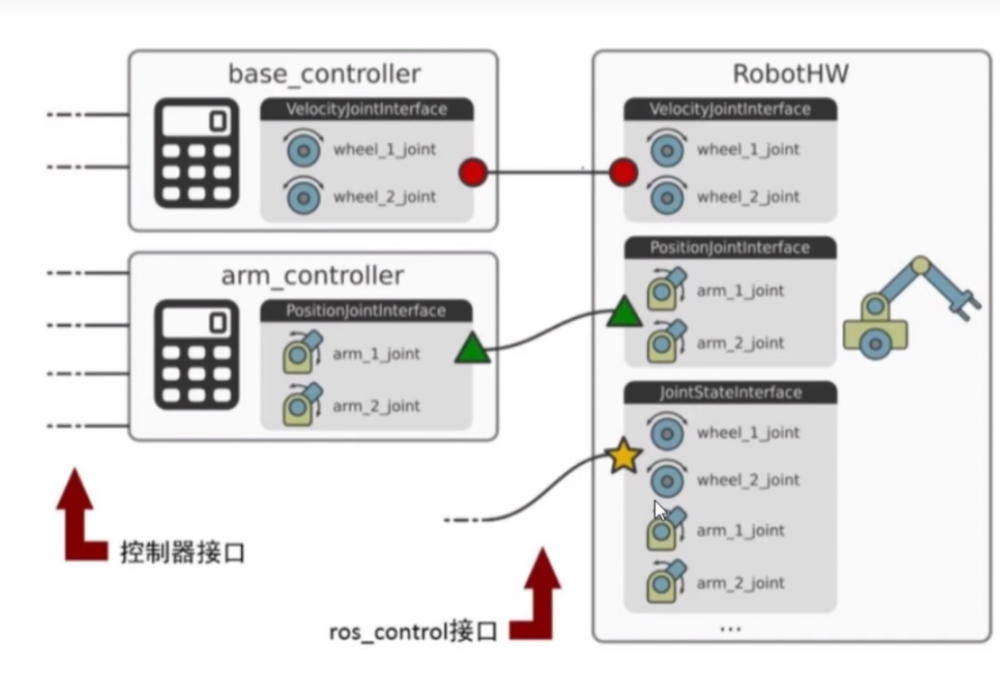
> **控制器管理器**
> 提供一种通用的接口来管理不同的控制器
> **控制器**
> 读取硬件状态，发布控制命令，完成每个joint的控制
> **硬件资源**
> 为上下两层提供硬件资源的接口
> **机器人硬件抽象**
> 机器人硬件抽象和硬件资源打交道，通过write和read方法完成硬件操作
> **真实机器人**
> 我们接收到的命令

**控制器(controllers):**
- joint_state_controller
- joint_effort_controller
- joint_position_controller
- joint_velocity_controller
##### 5.1.3 Moveit机器人控制框架
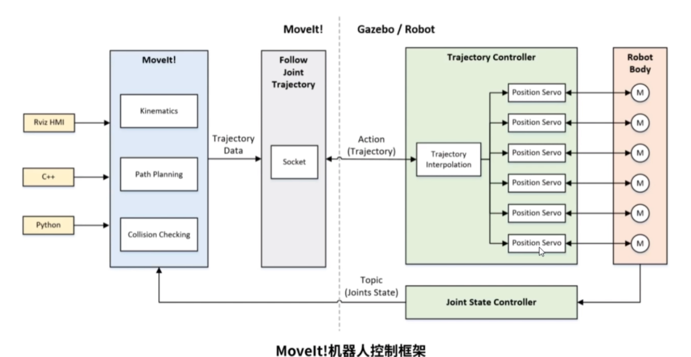
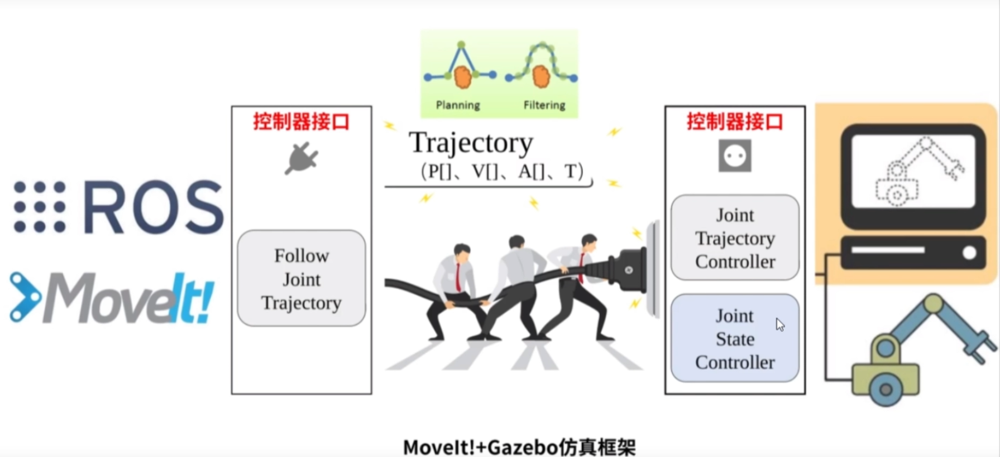
#### 5.2 Gazebo仿真配置流程
##### 5.2.1 完善机器人模型
**第一步： 为link添加惯性参数和碰撞属性**
如图所示，在机械臂的模型文件中为每个link添加红色框中的惯性参数与碰撞属性。这一步当使用其他软件生成模型URDF文件时一般会已经自动完成。
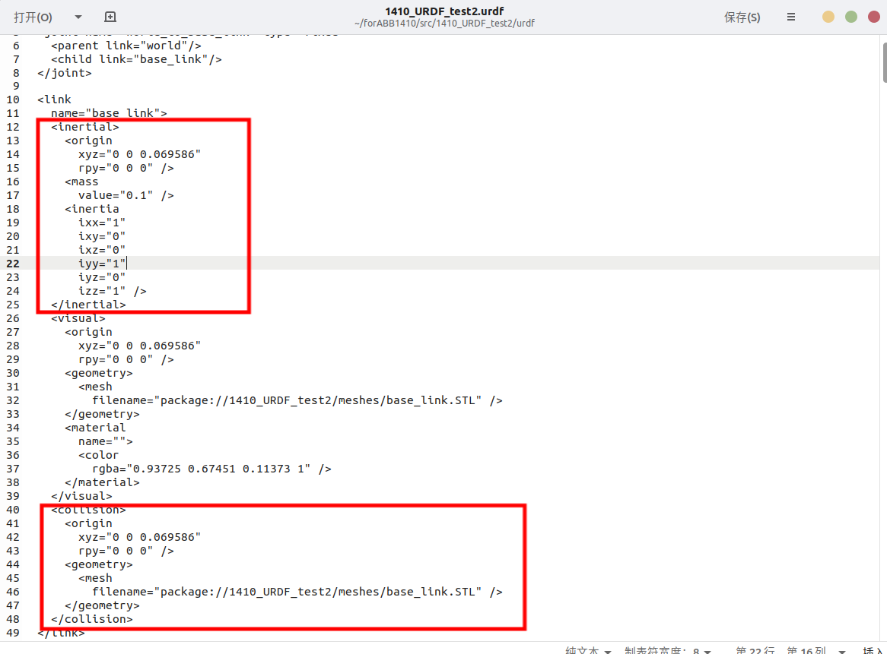
**第二步： 为joint添加传动装置**
如图所示，在URDF文件中为每个joint添加传动装置。
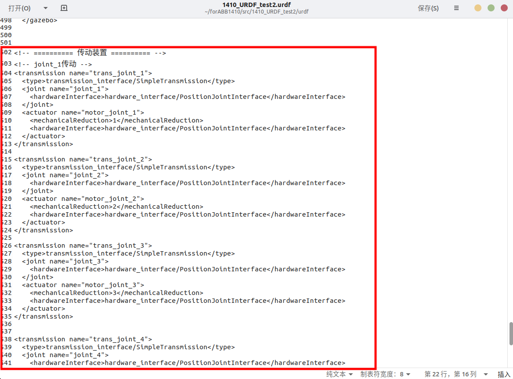
**第三步： 添加gazebo控制器插件**
如图所示，在URDF文件中配置Gazebo控制器插件以便gazebo能够正确仿真模型。
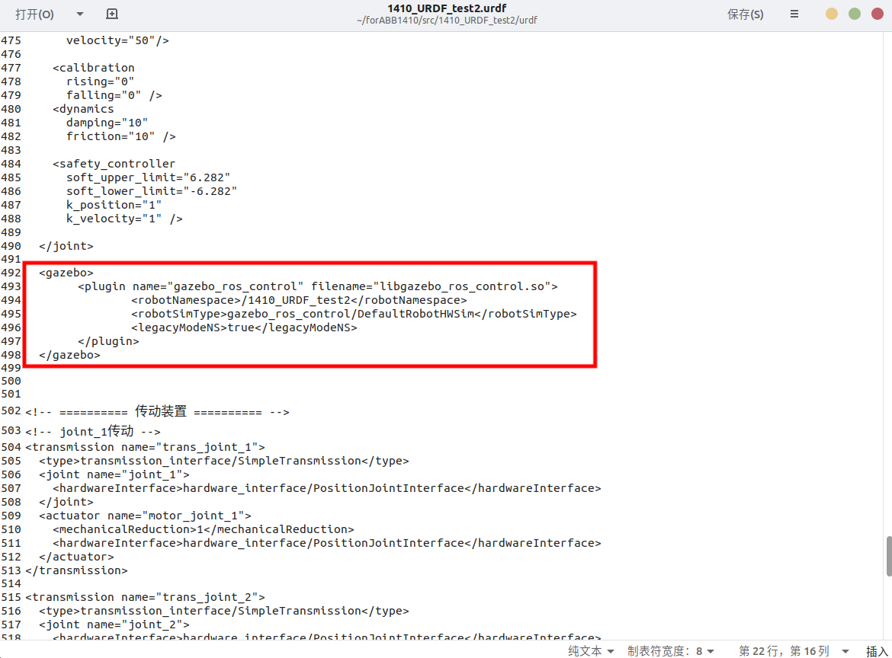

##### 5.2.2 控制器与关节状态发布器参数配置
**在工作空间下新建一个包存储gazebo仿真配置相关文件**
```bash
cd ~/forABB1410/src
catkin_create_pkg abb_1410_gazebo moveit_ros_planning_interface roscpp rospy std_msgs geometry_msgs
```
**创建轨迹控制器参数配置文件**
```bash
cd ~/forABB1410/src/abb_1410_gazebo
mkdir config
touch trajectory_control.yaml
```
轨迹控制器参数配置文件内容如下：
```yaml
1410_URDF_test2:
        arm_joint_controller:
                type: "position_controllers/JointTrajectoryController"
                joints:
                        - joint_1
                        - joint_2
                        - joint_3
                        - joint_4
                        - joint_5
                        - joint_6
                initial_positions: [0, 0, 0, 0, 0, 0]
                gains:
                        joint_1: {p: 10000, i: 0.5, d: 1.0, i_clamp: 1.0}
                        joint_2: {p: 1000.0, i: 0.5, d: 1.0, i_clamp: 0}
                        joint_3: {p: 1000.0, i: 0.5, d: 1.0, i_clamp: 0}
                        joint_4: {p: 10000.0, i: 0.5, d: 1.0, i_clamp: 0}
                        joint_5: {p: 1.0, i: 0, d: 0, i_clamp: 0}
                        joint_6: {p: 1.0, i: 0, d: 0, i_clamp: 0}
        gazebo_ros_control:   
                pid_gains:
                        joint_1: {p: 10000, i: 0.5, d: 1.0, i_clamp: 1.0}
                        joint_2: {p: 1000.0, i: 0.5, d: 1.0, i_clamp: 0}
                        joint_3: {p: 1000.0, i: 0.5, d: 1.0, i_clamp: 0}
                        joint_4: {p: 10000.0, i: 0.5, d: 1.0, i_clamp: 0}
                        joint_5: {p: 1.0, i: 0, d: 0, i_clamp: 0}
                        joint_6: {p: 1.0, i: 0, d: 0, i_clamp: 0}
```
在该文件中我们配置了`ros_control`要加载的控制器类型为`JointTrajectoryController`，并且设定了控制器的PID参数。上述显示的PID参数仅供参考，具体的参数应当根据自己所选取的机械臂模型自行调试设置。
在上述文件中定义了两组看起来相似的PID（或PD）增益参数，它们分别位于 arm_joint_controller 下的 gains 和 gazebo_ros_control 下的 pid_gains。这两组参数服务于ROS控制栈的不同层面，通常需要独立调整，其值也无需保持一致：
1. **arm_joint_controller/gains:**
   - 作用对象: 这些增益是为 ros_control 框架中的上层控制器（在此例中是 position_controllers/JointTrajectoryController）配置的。
   - 控制目标: JointTrajectoryController 负责接收一个期望的关节轨迹（包含时间戳、位置、可能还有速度和加速度），并根据这条轨迹计算出在每个控制周期应该发送给"底层硬件"（在仿真中即 gazebo_ros_control 插件）的指令。对于 PositionJointInterface，它会发送期望的关节位置。
   - 影响: 这组 gains 主要影响 JointTrajectoryController 如何跟踪输入的目标轨迹，如何平滑地在轨迹段之间过渡，以及如何响应跟踪误差来生成这些发送给底层的指令。如果底层（Gazebo的PID）已经能很好地跟踪位置，这组参数的影响可能不那么直接，但对于整体轨迹的平顺性和动态响应仍有作用。
2. **gazebo_ros_control/pid_gains:**
   - 作用对象: 这些 pid_gains 是专门为 Gazebo 中的 gazebo_ros_control 插件配置的。
   - 控制目标: 当上层的 JointTrajectoryController 通过 PositionJointInterface 向 Gazebo 中的模拟关节发送一个目标位置时，gazebo_ros_control 插件会利用这些PID增益在 Gazebo 的物理引擎中施加计算出的力或扭矩，以驱动模拟关节达到并稳定地保持在该目标位置。它们直接模拟了真实机器人硬件底层伺服控制器的行为。
   - 影响: 这组PID参数直接决定了机器人在Gazebo仿真环境中的"物理"表现：关节的刚度（P）、阻尼（D）、对外部扰动（如重力、碰撞）的抵抗能力，以及对目标指令的响应速度和稳定性。如果这些值不当，机器人模型在仿真中可能会显得"软弱"、抖动、过冲或振荡，即使上层控制器发送了完美的指令。Gazebo控制台通常会在缺少这些参数时报告 "No p gain specified for pid..."。

**创建关节状态发布器参数配置文件**
```bash
cd ~/forABB1410/src/abb_1410_gazebo
mkdir config
touch gazebo_joint_states.yaml
```
具体内容如下：
```yaml
1410_URDF_test2:
        joint_state_controller:
                type: joint_state_controller/JointStateController
                publish_rate: 50
```
在该文件中定义了关节状态控制器的类型与发布频率。

##### 5.2.3 实现Gazebo仿真的各项启动文件配置
**新建启动文件文件夹**
```bash
cd ~/forABB1410/src/abb_1410_gazebo
mkdir launch
```
**Gazebo启动文件设置**
```bash
cd ~/forABB1410/src/abb_1410_gazebo/launch
touch abb_1410_gazebo_world.launch
```
其具体内容如下：
```launch
<launch>
 
  <!-- these are the arguments you can pass this launch file, for example paused:=true -->
  <arg name="paused" default="false"/>
  <arg name="use_sim_time" default="true"/>
  <arg name="gui" default="true"/>
  <arg name="headless" default="false"/>
  <arg name="debug" default="false"/>
 
  <!-- We resume the logic in empty_world.launch -->
  <include file="$(find gazebo_ros)/launch/empty_world.launch">
    <arg name="debug" value="$(arg debug)" />
    <arg name="gui" value="$(arg gui)" />
    <arg name="paused" value="$(arg paused)"/>
    <arg name="use_sim_time" value="$(arg use_sim_time)"/>
    <arg name="headless" value="$(arg headless)"/>
  </include>
 
  <!-- Load the URDF into the ROS Parameter Server -->
  <param name="robot_description" textfile="$(find 1410_URDF_test2)/urdf/1410_URDF_test2.urdf" /> 
 
 
  <!-- Run a python script to the send a service call to gazebo_ros to spawn a URDF robot -->
  <node name="urdf_spawner" pkg="gazebo_ros" type="spawn_model" respawn="false" output="screen"
	args="-urdf -model 1410_URDF_test2 -param robot_description"/> 
</launch>
```
在该启动文件中配置了Gazebo的各项参数并导入了所使用的机器人URDF模型文件。
**控制器启动文件设置**
```bash
cd ~/forABB1410/src/abb_1410_gazebo/launch
touch trajectory_controller.launch
```
其具体内容如下：
```launch
<launch>
	<rosparam file="$(find abb_1410_gazebo)/config/trajectory_control.yaml" command="load"/>
	<node name="arm_controller_spawner" pkg="controller_manager" type="spawner" respawn="false" output="screen" ns="/1410_URDF_test2" args="arm_joint_controller"/>
</launch>
```
在该启动文件中加载了刚刚设置的控制器参数并启动控制器，使机械臂能够执行由MoveIt或其他高级控制软件生成的轨迹。
**关节状态发布器启动文件设置**
```bash
cd ~/forABB1410/src/abb_1410_gazebo/launch
touch gazebo_states.launch
```
其具体内容如下：
```launch
<launch>
	<rosparam file="$(find abb_1410_gazebo)/config/gazebo_joint_states.yaml" command="load"/>
	
	<node name="joint_controller_spawner" pkg="controller_manager" type="spawner" respawn="false" output="screen" ns="/1410_URDF_test2" args="joint_state_controller" />
	
	<node name="robot_state_publisher" pkg="robot_state_publisher" type="robot_state_publisher" respawn="false" output="screen">
		<remap from="/joint_states" to="/1410_URDF_test2/joint_states" />
	</node>

	<node name="joint_states_relay" pkg="topic_tools" type="relay" args="/1410_URDF_test2/joint_states /joint_states" output="screen" />
</launch>
```
这个gazebo_states.launch文件用于设置和启动机械臂在Gazebo仿真中的状态发布系统。它主要负责机械臂关节状态的监控和发布，这是实现可视化和闭环控制的基础。
**将上述启动文件整合到一起**
为了后续使用更加方便，我们可以将上述启动文件整合为一个统一的启动文件
```bash
cd ~/forABB1410/src/abb_1410_gazebo/launch
touch abb_1410_bringup_moveit.launch
```
其具体内容如下：
```launch
<launch>
	<!-- 启动Gazebo仿真环境 -->
	<include file="$(find abb_1410_gazebo)/launch/1410_URDF_test2/abb_1410_gazebo_world.launch" />

	<!-- 启动关节状态发布器和控制器 -->
	<include file="$(find abb_1410_gazebo)/launch/1410_URDF_test2/gazebo_states.launch" />
	<include file="$(find abb_1410_gazebo)/launch/1410_URDF_test2/trajectory_controller.launch" />
</launch>
```
这样我们在后续使用时只需启动该启动文件即可。

#### 5.3 Gazebo仿真指令
1. 首先确保 ROS 环境已经初始化：
   ```bash
   source /opt/ros/noetic/setup.bash
   source ~/forAbb1410/devel/setup.bash  # 根据实际工作空间路径调整
   ```
2. 启动 Gazebo 仿真环境与控制器、关节状态发布器：
   ```bash
   roslaunch abb_1410_gazebo abb_1410_bringup_moveit.launch
   ```
3. 启动 MoveIt 演示环境：
   ```bash
   roslaunch abb_1410_moveit_config demo.launch moveit_controller_manager:=ros_control
   ```
   MoveIt的 demo.launch 文件通常有一个参数用于指定控制器管理器，其默认值为"fake"，为了连接到Gazebo中通过 ros_control 管理的控制器，我们需要将此参数设置为 ros_control。
#### 5.4 MoveIt + Gazebo联合仿真效果展示
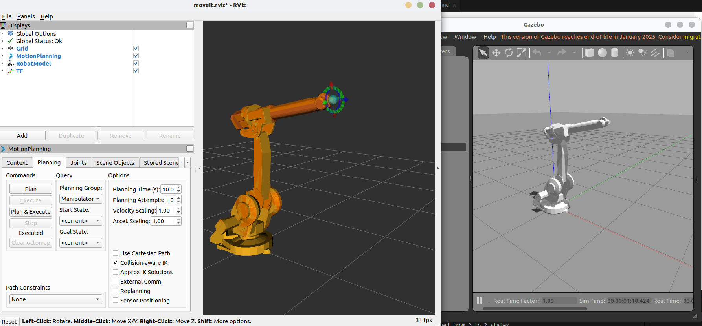
如图所示，在Gazebo中我们可以看到机械臂的运动轨迹与MoveIt中的运动轨迹一致，且机械臂的关节状态也能够实时更新。通过这种方式，我们可以在Gazebo中进行更复杂的仿真测试和验证。