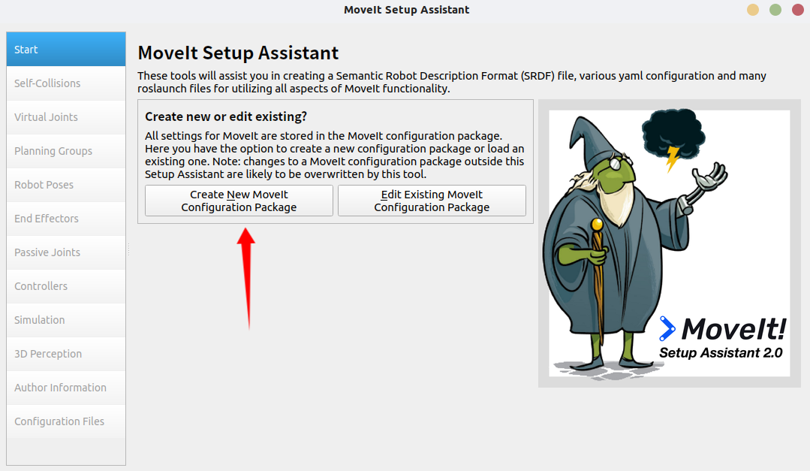
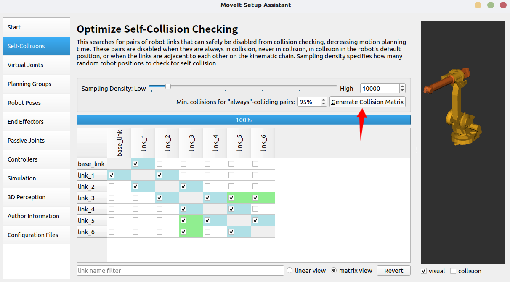

# ABB IRB 1410 机械臂 ROS 控制项目

## 项目介绍

本项目基于 ROS (Robot Operating System) 实现了对 ABB IRB 1410 工业机械臂的运动规划和控制。通过 MoveIt 框架提供的功能，可以进行轨迹规划、碰撞检测、运动执行等操作。

## 项目文件目录介绍

项目主要由以下几个 ROS 包组成：

- **abb_1410_demo**: 提供机械臂的运动规划配置代码
- **abb_1410_moveit_config**: MoveIt 配置包，包含演示和应用程序，用于展示机械臂的运动功能
- **1410_URDF_test2**: 包含机械臂的 URDF 描述文件
- **abb_1410_gazebo**: 提供 Gazebo 模拟环境配置，用于虚拟测试


## 项目环境介绍

- **操作系统**: Ubuntu 20.04 (推荐)
- **ROS 版本**: ROS Noetic
- **依赖库**:
  - MoveIt 框架
  - RViz 可视化工具
  - Gazebo 模拟器

## ABB IRB 1410 机械臂结构介绍

ABB IRB 1410 是一款工业级 6 自由度机械臂，特点如下：

- **自由度**: 6 个旋转关节
- **负载能力**: 约 5kg
- **工作范围**: 水平方向约 1.44m
- **关节结构**:
  - `base_link`: 基座
  - `link_1`: 转台
  - `link_2`: 大臂
  - `link_3`: 小臂
  - `link_4`: 腕部旋转
  - `link_5`: 腕部俯仰
  - `link_6`: 末端执行器连接

机械臂的运动通过配置的规划器（默认使用 OMPL），能够实现从当前位置到目标位置的无碰撞轨迹规划。

## 运行 abb_1410_demo 运动控制程序的方法

1. 首先确保 ROS 环境已经初始化：
   ```bash
   source /opt/ros/noetic/setup.bash
   source ~/forAbb1410/devel/setup.bash  # 根据实际工作空间路径调整
   ```

2. 启动 MoveIt 演示环境：
   ```bash
   roslaunch abb_1410_moveit_config demo.launch
   ```

3. 在新的终端中运行演示程序：

   1.**正向运动学演示**：根据当处于给定的预设点时的关节角度，计算机器人末端执行器的位姿（位置和姿态），从而进行6点运动控制。
    ```bash
   rosrun abb_1410_demo moveit_fk_demo.py 
    ```
   2.**正向运动学演示**：根据当处于预设点时末端执行器的目标位姿，计算满足该位姿的关节角度组合（可能存在多解或无解），从而进行6点运动控制。
    ```bash
   rosrun abb_1410_demo moveit_ik_demo.py 
    ```
   3.**MoveL演示**：在2的基础上将部分点之间的运动规划从MoveJ改为MoveL
   ```bash
   rosrun abb_1410_demo moveit_ik_moveL_demo.py 
   ```
   4.**轨迹规划演示**：控制机械臂完成包括8字形轨迹、圆形轨迹、螺旋轨迹在内的一系列轨迹。
    ```bash
    rosrun abb_1410_demo moveit_traj_demo.py 
    ```
    **附注**：当启动Rviz并执行以上任意一个程序之后可以在rviz中订阅话题`/visualization_marker/Marker`实时显示机械臂末端执行器的运动轨迹。
## 从零构建流程步骤

### 一. ROS 安装
#### 1.1 设置 ROS 软件源
```bash
sudo sh -c 'echo "deb http://packages.ros.org/ros/ubuntu $(lsb_release -sc) main" > /etc/apt/sources.list.d/ros-latest.list'
```
#### 1.2 添加密钥
```bash
sudo apt install curl       # 确保curl已安装
curl -s https://raw.githubusercontent.com/ros/rosdistro/master/ros.asc | sudo apt-key add -
```
#### 1.3 更新软件包列表
```bash
sudo apt update
```
#### 1.4 安装 ROS Noetic 桌面完整版
```bash
sudo apt install ros-noetic-desktop-full
```
#### 1.5 设置环境变量
```bash
echo "source /opt/ros/noetic/setup.bash" >> ~/.bashrc
source ~/.bashrc
```
#### 1.6 安装构建工具等其他package依赖
```bash
sudo apt install python3-catkin-tools python3-rosdep python3-rosinstall python3-rosinstall-generator python3-wstool build-essential
```
#### 1.7 初始化 rosdep(依赖管理工具)
```bash
sudo rosdep init
rosdep update
```
### 二. MoveIt 安装
```bash
# 安装 MoveIt
sudo apt install ros-noetic-moveit
# 安装MoveIt附加组件
sudo apt install ros-noetic-moveit-ros-visualization ros-noetic-moveit-planners ros-noetic-moveit-ros-move-group ros-noetic-moveit-ros-perception
```
### 三. 导出机械臂URDF模型并使用MoveIt Setup Assistant创建配置包
#### 3.1 创建工作空间
```bash
# 创建工作空间
mkdir -p ~/forAbb1410/src
cd ~/forAbb1410/
# 初始化工作空间
catkin init
```
#### 3.2 下载机械臂URDF模型
所使用机械臂的URDF模型可以通过SolidWorks等软件导出，或者直接从开源网站如Github上下载。在这里推荐一个开源的机器人模型库：[awesome-robot-descriptions](https://github.com/robot-descriptions/awesome-robot-descriptions)
本项目机械臂模型文件夹为`1410_URDF_test2`，包含了机械臂的URDF文件和相关资源。


#### 3.3 启动MoveIt Setup Assistant
```bash
roslaunch moveit_setup_assistant setup_assistant.launch
```
界面如下图所示：

点击箭头所指的按钮，选择`1410_URDF_test2`文件夹下的`/urdf/1410_URDF_test2.urdf`文件，或者其他任意机械臂模型的URDF文件，点击`Load File`按钮即可看到你所选择的机械臂模型。

### 3.4 配置Moveit配置包
在MoveIt Setup Assistant中，左边一列是一系列的MoveIt配置选项，具体内容如下：

接下来，我们将逐步配置MoveIt各项设置。
#### 3.4.1 生成碰撞矩阵
点击左侧的`Self-Collisions`按钮，进入机械臂自碰撞检测，点击红色箭头指示的`Generate Collision Matrix`即可生成自碰撞矩阵，在这里可检查配置的机械臂各关节之间是否会发生自碰撞等信息。

#### 3.4.2 规划组配置
点击左侧的`Planning Groups`按钮，进入规划组配置，点击红色箭头指示的`Add Group`即可添加规划组，

按照箭头顺序，我们首先为该规划组命名，一般来说我们命名为`manipulator`或`Manipulator`；然后我们选择运动学求解器`Kinematic Solver`，一般选择`KDL`；接下来我们一般设定OMPL规划器为`RRTConnectkConfigDefault`；最后我们点击`Add Kin. chain`按钮，添加机械臂的运动学链，选择`base_link`为根节点，选择`link_6`为末端执行器节点，点击`Save`按钮即可完成规划组配置。


#### 3.4.3 机器人姿态配置
点击左侧的`Robot Poses`按钮，进入机器人姿态配置，点击红色箭头指示的`Add Pose`按钮即可添加机器人姿态配置。

通过设定右侧各个关节的旋转角度，来设定机械臂的姿态，同时对当前姿态进行命名，点击`Save`按钮即可完成机器人姿态配置，保存当前设置的姿态信息。

如图所示，我设置了一个`home`姿态，表示机械臂的初始位置。你也可以保存其他姿态，方便后续的运动控制。
#### 3.4.4 个人信息设置
点击左侧的`Author Information`按钮，进入个人信息设置，即可填写个人的姓名、邮箱等信息，以便于他人使用你的配置文件时联系你。

#### 3.4.5 配置信息确认与保存
点击左侧的`Configuration Files`按钮，进入配置文件确认与保存界面，配置文件保存地址选择刚刚在我们创建的工作空间下的src文件夹下新建一个moveit配置文件夹，习惯来说我们会以`xxx_moveit_config`来命名该文件夹以代表其为MoveIt配置文件夹，点击`Generate Package`按钮即可生成MoveIt配置包。


### 3.5 编译项目
```bash
# 回到工作空间
cd ~/forAbb1410/
# 编译
catkin_make
# 刷新环境
source devel/setup.bash
```
### 3.6 启动MoveIt Rviz演示
```bash
roslaunch abb_1410_moveit_config demo.launch
```

这将启动RViz，显示机械臂的模型，并可以通过MoveIt插件进行规划和控制。

### 四. 机械臂控制脚本编写
#### 4.1 创建控制脚本包
在工作空间下的src文件夹下创建一个新的ROS包，命名为`abb_1410_demo`，其中将储存机械臂控制脚本。
```bash
cd ~/forAbb1410/src
catkin_create_pkg abb_1410_demo moveit_ros_planning_interface roscpp rospy std_msgs geometry_msgs
```
#### 4.2 正向运动学6点控制
##### 4.2.1 正向运动学简介
正向运动学是指根据机械臂各关节的角度，计算出末端执行器的位置和姿态。通过正向运动学，我们可以控制机械臂的末端执行器到达指定的位置和姿态。
##### 4.2.1 新建正向运动学控制脚本
```bash
cd ~/forAbb1410/src/abb_1410_demo
mkdir scripts
cd scripts
touch moveit_fk_demo.py
chmod +x moveit_fk_demo.py
```
##### 4.2.2 编辑正向运动学控制脚本
使用您喜欢的编辑器打开 `moveit_fk_demo.py` 文件并添加配置代码
代码内容内容详见[./src/abb_1410_demo/scripts/moveit_fk_demo.py](./src/abb_1410_demo/scripts/moveit_fk_demo.py)
##### 4.2.3 代码解析
该正向运动学控制脚本实现了以下功能：

1. **初始化设置**：
   - 初始化MoveIt API和ROS节点
   - 设置参考坐标系为`base_link`
   - 配置运动组为`Manipulator`
   - 设置运动精度、最大速度和加速度限制

2. **轨迹可视化**：
   - 创建轨迹标记发布器，用于在RViz中可视化末端执行器的运动轨迹
   - 实现轨迹点记录和清除功能
   - 使用红色线条实时显示机械臂末端执行器的运动路径

3. **预设关节位置**：
   - 预定义7组关节角度值，代表机械臂需要依次到达的7个位置
   - 最后一组为全零位置，使机械臂回到中立姿态

4. **执行流程**：
   - 首先清除之前的轨迹记录
   - 启动轨迹记录定时器，每0.05秒记录一次当前末端执行器位置
   - 依次执行预设的7组关节角度移动
   - 每次移动后暂停1秒，便于观察
   - 最后回到初始化位置（home），并关闭MoveIt
##### 4.2.4 核心方法详解
正向运动学控制脚本中使用的核心方法及其功能:
1. **MoveIt 初始化与配置方法**:
   - `moveit_commander.roscpp_initialize(sys.argv)`: 初始化 MoveIt 的 C++ 接口
   - `rospy.init_node('moveit_fk_demo', anonymous=True)`: 创建 ROS 节点
   - `self.arm = moveit_commander.MoveGroupCommander('Manipulator')`: 创建机械臂控制对象，指定规划组名称
   - `self.arm.set_goal_joint_tolerance(0.001)`: 设置关节角度规划的误差容忍度
   - `self.arm.set_max_acceleration_scaling_factor(0.5)`: 限制最大加速度为默认值的 50%
   - `self.arm.set_max_velocity_scaling_factor(0.5)`: 限制最大速度为默认值的 50%

2. **机械臂位置控制方法**:
   - `self.arm.set_named_target('home')`: 设置目标位置为命名姿态 'home'（在 MoveIt Setup Assistant 中定义）
   - `self.arm.set_joint_value_target(joint_position)`: 通过关节角度值设置目标位置
   - `self.arm.go()`: 规划并执行移动到目标位置，返回是否成功的布尔值
   - `self.arm.get_current_pose(self.end_effector_link)`: 获取当前末端执行器的位姿

3. **轨迹记录与可视化方法**:
   - `self.marker_publisher = rospy.Publisher('/visualization_marker', Marker, queue_size=100)`: 创建标记消息发布器
   - `rospy.Timer(rospy.Duration(0.2), self.publish_trajectory_marker)`: 创建定时器，定期执行轨迹标记发布
   - `self.record_trajectory_point()`: 记录当前末端执行器位置
   - `self.publish_trajectory_marker()`: 将记录的轨迹点转换为 RViz 可视化标记并发布
   - `self.clear_trajectory()`: 清除之前记录的轨迹点和可视化标记

4. **Marker 消息创建**:
   - `marker = Marker()`: 创建 RViz 可视化标记对象
   - `marker.type = Marker.LINE_STRIP`: 设置标记类型为线条
   - `marker.action = Marker.ADD`: 添加新标记
   - `marker.lifetime = rospy.Duration(0)`: 设置标记永久存在（直到被删除）

5. **程序控制流方法**:
   - `rospy.sleep(1)`: 暂停程序执行指定秒数
   - `trajectory_recorder = rospy.Timer(...)`: 创建定时器对象记录轨迹
   - `trajectory_recorder.shutdown()`: 停止定时器
   - `moveit_commander.roscpp_shutdown()`: 关闭 MoveIt 接口
   - `moveit_commander.os._exit(0)`: 安全退出程序

这些方法结合起来，实现了通过预设的关节角度序列控制机械臂运动，并同时记录和可视化末端执行器的运动轨迹。其中，FK (Forward Kinematics, 正向运动学) 的核心在于通过直接指定关节角度 (`set_joint_value_target`) 来控制机械臂运动，而不是通过指定末端执行器的位置和姿态。这种方法在需要精确控制各关节角度的场景中特别有用。
##### 4.2.5 效果展示

#### 4.3 逆向运动学6点控制
##### 4.3.1 逆向运动学简介
逆向运动学是指根据机械臂末端执行器的目标位置和姿态，计算出满足该位姿的关节角度组合。通过逆向运动学，我们可以控制机械臂的末端执行器到达指定的位置和姿态。
##### 4.3.1 新建逆向运动学控制脚本
```bash
cd ~/forAbb1410/src/abb_1410_demo/scripts
touch moveit_ik_demo.py
chmod +x moveit_ik_demo.py
```
##### 4.3.2 编辑逆向运动学控制脚本
使用您喜欢的编辑器打开 `moveit_ik_demo.py` 文件并添加配置代码
代码内容内容详见[./src/abb_1410_demo/scripts/moveit_ik_demo.py](./src/abb_1410_demo/scripts/moveit_ik_demo.py)
##### 4.3.3 代码解析
该逆向运动学控制脚本实现了以下功能：

1. **初始化与配置**：
   - 初始化MoveIt API和ROS节点
   - 配置机械臂控制组为`Manipulator`
   - 设置参考坐标系为`base_link`
   - 配置位置和姿态的允许误差
   - 设置规划失败重试许可和最大速度/加速度限制

2. **轨迹可视化**：
   - 与FK脚本类似，提供了轨迹记录和可视化功能
   - 使用红色线条实时显示机械臂末端执行器的运动轨迹

3. **预设目标位姿**：
   - 预定义7个末端执行器的目标位姿，每个位姿使用位置(x,y,z)和四元数姿态(x,y,z,w)表示
   - 位姿序列组成了一个方形轨迹，用于演示机械臂的运动规划能力

4. **关节角度输出**：
   - 提供关节角度打印功能，同时显示弧度和角度单位
   - 在每个位姿规划成功后显示对应的关节角度值

5. **执行流程**：
   - 清除之前的轨迹记录
   - 获取预设的目标位姿序列
   - 开始记录轨迹
   - 依次设置每个目标位姿，规划并执行移动
   - 打印当前关节角度
   - 移动完成后恢复到初始化位置，关闭MoveIt
##### 4.3.4 核心方法详解
逆向运动学控制脚本中使用的核心方法及其功能:

1. **MoveIt配置相关方法**:
   - self.arm.set_pose_reference_frame(self.reference_frame): 设置位姿参考坐标系
   - self.arm.allow_replanning(True): 允许在规划失败时重新规划
   - self.arm.set_goal_position_tolerance(0.001): 设置位置误差容忍度(米)
   - self.arm.set_goal_orientation_tolerance(0.01): 设置姿态误差容忍度(弧度)
   - self.arm.get_active_joints(): 获取活动关节名称列表
2. **逆向运动学核心方法**:
   - self.arm.set_pose_target(target_pose): 设置末端执行器的目标位姿
   - self.arm.plan(): 规划从当前位置到目标位姿的轨迹，返回规划结果
   - self.arm.execute(traj): 执行规划出的轨迹
   - self.arm.set_start_state_to_current_state(): 设置规划起点为当前状态
3. **姿态构建与关节状态方法**:
   - target_pose = PoseStamped(): 创建带有时间戳和参考坐标系的位姿对象
   - target_pose.pose.position.x/y/z: 设置目标位置坐标
   - target_pose.pose.orientation.x/y/z/w: 设置目标姿态四元数
   - self.arm.get_current_joint_values(): 获取当前关节角度值
   - np.degrees(current_joints): 将弧度转换为角度
4. **规划结果处理**:
   - if plan and isinstance(plan, tuple) and plan[0]: 检查规划是否成功
   - traj = plan[1]: 从规划结果中提取轨迹部分
   - self.print_joint_angles(): 打印当前关节角度，便于调试

与正向运动学不同的是，这里使用了`set_pose_target`方法设置末端执行器的目标位姿，而不是直接设置关节角度值。MoveIt会自动进行逆向运动学(IK)求解，计算出到达该位姿所需的关节角度组合。这种基于任务空间的控制方式更符合大多数实际应用场景，用户只需关心工具的位置和姿态，而不需要计算具体的关节角度。
##### 4.3.5 效果展示

#### 4.4 逆向运动学 MoveL 4点控制
##### 4.4.1 MoveL简介
MoveL是指机械臂在运动过程中，末端执行器沿着一条直线轨迹移动，而不是沿着关节空间的路径进行运动。MoveL通常用于需要精确控制末端执行器位置的场景，如焊接、喷涂等应用。
##### 4.4.2 新建MoveL控制脚本
```bash
cd ~/forAbb1410/src/abb_1410_demo/scripts
touch moveit_ik_moveL_demo.py
chmod +x moveit_ik_moveL_demo.py
```
##### 4.4.3 编辑MoveL控制脚本
使用您喜欢的编辑器打开 `moveit_ik_moveL_demo.py` 文件并添加配置代码
代码内容内容详见[./src/abb_1410_demo/scripts/moveit_ik_moveL_demo.py](./src/abb_1410_demo/scripts/moveit_ik_moveL_demo.py)
##### 4.4.4 代码解析
该MoveL控制脚本实现了以下功能：
1. **初始化与配置**：
   - 初始化MoveIt API和ROS节点
   - 配置机械臂控制组为`Manipulator`
   - 设置参考坐标系为`base_link`
   - 配置位置和姿态的允许误差
   - 设置规划失败重试许可和最大速度/加速度限制
2. **轨迹可视化**：
   - 与FK脚本类似，提供了轨迹记录和可视化功能
   - 使用红色线条实时显示机械臂末端执行器的运动轨迹
3. **预设目标位姿**：
   - 预定义4个末端执行器的目标位姿，每个位姿使用位置(x,y,z)和四元数姿态(x,y,z,w)表示
   - 位姿序列组成了一个方形轨迹，用于演示机械臂的运动规划能力
4. **关节角度输出**：
   - 提供关节角度打印功能，同时显示弧度和角度单位
   - 在每个位姿规划成功后显示对应的关节角度值
5. **执行流程**：
   - 清除之前的轨迹记录
   - 获取预设的目标位姿序列
   - 开始记录轨迹
   - 依次设置每个目标位姿，规划并执行移动
   - 打印当前关节角度
   - 移动完成后恢复到初始化位置，关闭MoveIt
##### 4.4.5 核心方法详解
**笛卡尔路径规划方法:**
- `arm.compute_cartesian_path(waypoints, 0.01, avoid_collisions=True):` 关键方法，根据给定路径点计算一条笛卡尔空间中的直线路径
   - **第一个参数 waypoints** 是位姿点列表，定义了直线路径的起点和终点
   - **第二个参数 0.01** 是路径分辨率(米)，控制路径点密度
   - **第三个参数 avoid_collisions** 决定是否进行碰撞检测和避障
   - **返回值 (plan, fraction):** plan 包含规划的轨迹；fraction 表示成功规划的路径比例(0~1)，1.0表示完整路径规划成功
##### 4.4.6 MoveL总结
该脚本中混合使用了两种不同的运动规划方法:
   - 对于路径点1→2和3→4: 使用 compute_cartesian_path 实现直线运动(MoveL)
   - 对于路径点2→3和4→5: 使用普通的 plan() 方法实现关节空间运动(MoveJ)

这种混合策略展示了在不同场景下选择最合适的运动规划方式

MoveL方式的关键优势在于能够保证末端执行器严格沿直线路径移动，这在某些工业应用中非常重要，例如:
- 焊接: 需要沿着焊缝直线移动
- 切割: 需要沿着切割线直线移动
- 喷涂: 需要保持与表面的一致距离
- 装配: 需要沿着特定轨迹插入零件

与普通IK不同，MoveL保证了末端轨迹的几何特性，而不仅仅是起点和终点位姿的匹配。由于使用了笛卡尔空间规划，MoveL可能会受到机械臂运动学限制的影响，在某些情况下无法规划完整的直线路径。
##### 4.4.7 效果展示

如图所示，路径点home→1,1→2与3→4为MoveL路径，路径点2→3与4→home为MoveJ路径，由图上显示的轨迹可以清晰看到它们的区别。

